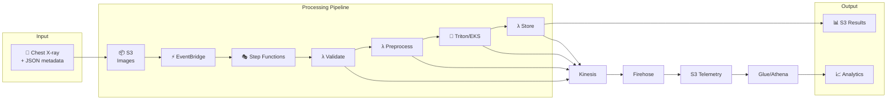
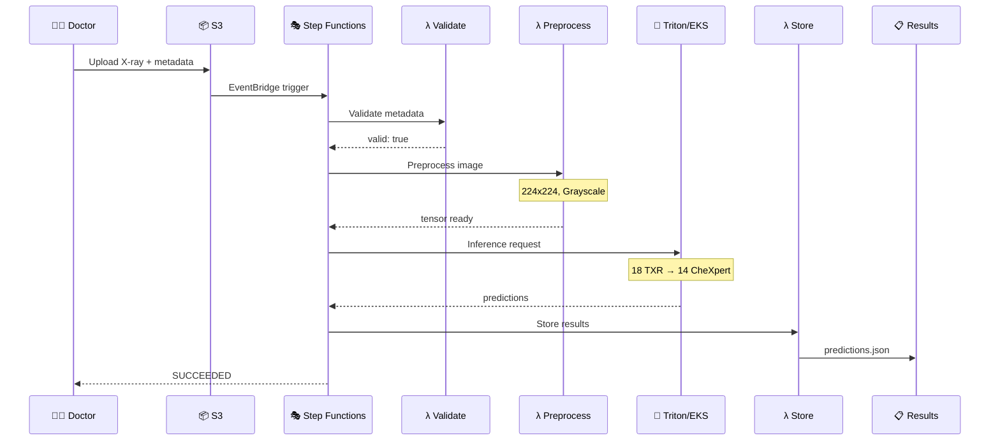

# RadStream: Cloud-Native Medical Imaging Pipeline

A serverless, event-driven medical imaging inference pipeline built on AWS demonstrating cloud-native architecture benefits for healthcare applications.


## Overview

RadStream processes chest X-ray images through an AWS serverless pipeline, performs AI-based pathology detection using NVIDIA Triton Inference Server on EKS, and provides real-time telemetry and analytics.

### Key Results

| Metric | Value |
|--------|-------|
| End-to-End Latency (p95) | **1.7 seconds** |
| Success Rate | **100%** |
| Throughput (parallel) | **365 images/min** |
| Cost per 1000 images | **$0.55** |
| Monthly Infrastructure | **~$100** |

## Architecture



### Sequence Diagram



## Quick Start

### Prerequisites

- AWS CLI configured with appropriate permissions
- Python 3.9+
- Docker (for container builds)
- kubectl & eksctl (for EKS management)

### Setup

```bash
# Clone repository
git clone https://github.com/rahul370139/RadStream.git
cd RadStream

# Create virtual environment
python3 -m venv venv
source venv/bin/activate

# Install dependencies
pip install -r requirements.txt

# Deploy infrastructure (in order)
python karthik/infrastructure/s3_setup.py
python karthik/infrastructure/lambda_setup.py
python karthik/infrastructure/stepfunctions_setup.py
python karthik/infrastructure/eventbridge_setup.py
python karthik/infrastructure/kinesis_setup.py
```

### Run Demo

```bash
# Single image test
python demo_single.py

# Multi-image parallel test
python demo_multi.py
```

## Project Structure

```
RadStream/
├── README.md                 # This file
├── requirements.txt          # Python dependencies
├── docs/                     # Documentation
│   ├── FINAL_REPORT.md      # Academic report
│   ├── ARCHITECTURE_DIAGRAM.md
│   ├── EVALUATION_RESULTS.md
│   ├── SETUP_GUIDE.md
│   └── LIVE_DEMO_SCRIPT.md
├── rahul/                    # Data & Serving Lead
│   ├── preprocessing/       # Lambda functions (5)
│   ├── scripts/             # Helper scripts
│   └── telemetry/           # Analytics code
├── mukul/                    # Platform Lead
│   └── inference/           # EKS/Triton configs
├── karthik/                  # Infrastructure Lead
│   ├── infrastructure/      # AWS setup scripts
│   └── security/            # IAM policies
├── model_repo/              # Triton model repository
│   └── chexpert_classifier/
└── test_images/             # Sample test data
```

## AWS Components

> **Note:** AWS resources are currently deleted to save costs. Infrastructure can be recreated using setup scripts.

| Service | Resource | Purpose |
|---------|----------|---------|
| **S3** | 4 buckets | Images, results, telemetry, artifacts |
| **Lambda** | 5 functions | Validate, preprocess, invoke, store, telemetry |
| **Step Functions** | 1 state machine | Workflow orchestration |
| **EKS** | 1 cluster | Triton Inference Server |
| **Kinesis** | 1 stream + Firehose | Real-time telemetry |
| **Glue/Athena** | Analytics | SQL queries on telemetry |

## Model Details

| Property | Value |
|----------|-------|
| Model | TorchXRayVision DenseNet |
| Format | ONNX |
| Input Shape | 1×1×224×224 (grayscale) |
| Output Shape | 1×18 (TXR logits) |
| Mapped Output | 14 CheXpert labels |
| Inference Server | NVIDIA Triton |

## Baseline Comparison

For local baseline inference comparison, see the **[CheXAgent CheXpert Evaluation](https://github.com/rahul370139/chexpert_labels)** project which provides:
- Local ONNX Runtime inference (~26ms)
- CheXpert 14-label evaluation
- Ensemble model approach

| Environment | Inference Time | Setup Time | Multi-User | Availability |
|-------------|---------------|------------|------------|--------------|
| **Local (Baseline)** | ~262ms | 24+ hours | ❌ Complex | ~99% |
| **Cloud (RadStream)** | ~337ms | Minutes (IaC) | ✅ Built-in | 99.99% SLA |

> **Note:** Cloud latency includes network overhead but provides enterprise-grade scalability, security, and 11-9s data durability.

## Performance

### Latency Distribution

| Percentile | Latency |
|------------|---------|
| p50 | 1,145ms |
| p95 | 1,754ms |
| p99 | 1,754ms |

### Stage Breakdown

| Stage | Time |
|-------|------|
| Validation | ~55ms |
| Preprocessing | ~850ms |
| Inference | ~300ms |
| Storage | ~180ms |
| Telemetry | ~34ms |

## Team

| Member | Role | Responsibilities |
|--------|------|------------------|
| **Rahul Sharma** | Data & Serving Lead | S3, Lambda functions, ONNX export, Triton integration |
| **Mukul Rayana** | Platform Lead | EKS cluster, container deployment, autoscaling |
| **Karthik Ramanathan** | Infrastructure Lead | EventBridge, Step Functions, Kinesis, IAM, security |

## Documentation

- [Architecture Diagrams](docs/ARCHITECTURE_DIAGRAM.md) - System architecture (Mermaid)
- [Evaluation Results](docs/EVALUATION_RESULTS.md) - Performance metrics & analysis
- [Setup Guide](docs/SETUP_GUIDE.md) - Infrastructure setup instructions
- [Final Report](docs/FINAL_REPORT.md) - Complete academic project report

## Security

- IAM least-privilege roles
- S3 encryption (AES-256)
- HTTPS/TLS on all endpoints
- VPC Security Groups
- CloudTrail audit logging
- AWS Shield Standard (DDoS)

## Cost Optimization

- CPU inference (96% savings vs GPU)
- Serverless compute (pay-per-use)
- Single Kinesis shard
- S3 lifecycle policies
- Free tier utilization

## License

MIT License - See LICENSE file for details.

## Acknowledgments

- AWS for cloud services
- NVIDIA for Triton Inference Server
- Stanford ML Group for CheXpert dataset
- TorchXRayVision contributors

---

**Repository:** https://github.com/rahul370139/RadStream  
**Course:** Cloud Computing - December 2025
