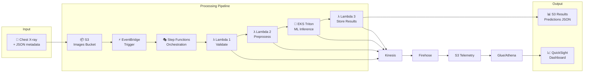
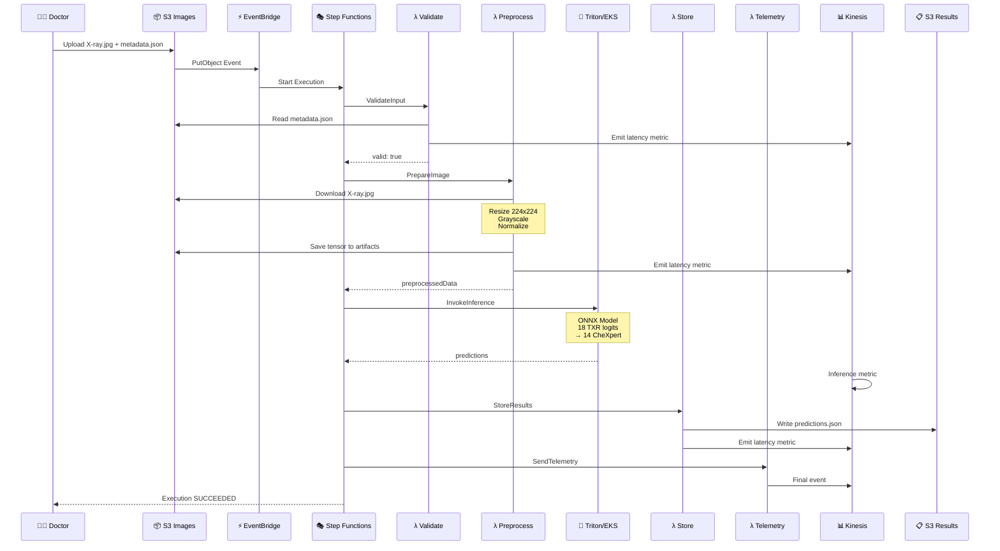
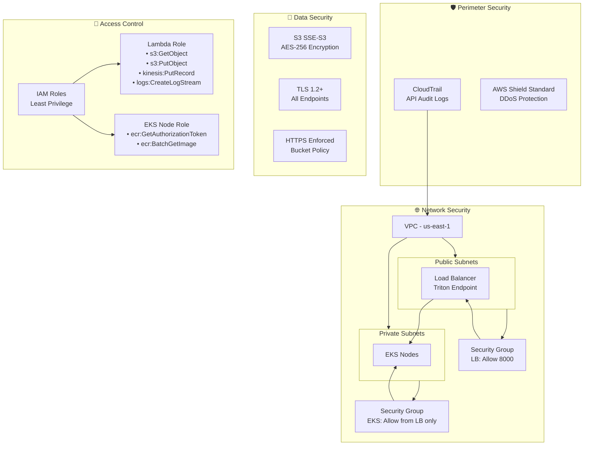
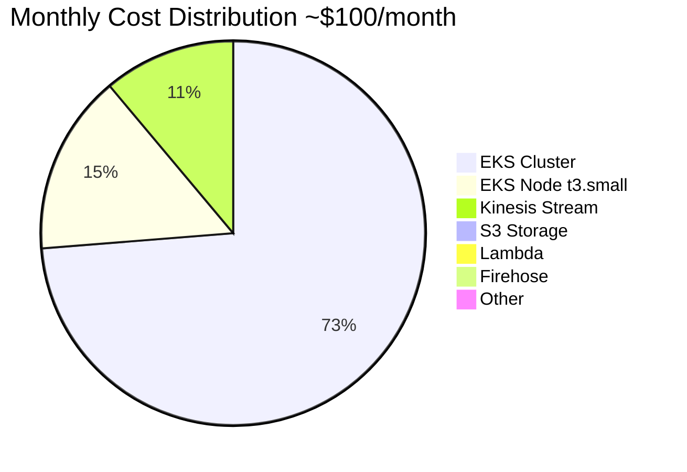

# RadStream: Cloud-Native Medical Imaging Pipeline Architecture

## Overview

RadStream is a cloud-native medical imaging inference pipeline designed to demonstrate the benefits of modern AWS services over traditional on-premises PACS (Picture Archiving and Communication Systems). The system processes medical images through a serverless workflow, performs AI inference using containerized models, and provides comprehensive telemetry and monitoring.

## Architecture Principles

- **Cloud-First**: Built specifically for AWS cloud services, not just cloud-hosted
- **Serverless**: Leverages AWS Lambda, Step Functions, and managed services
- **Event-Driven**: Uses EventBridge for loose coupling between components
- **Observable**: Comprehensive telemetry and monitoring throughout
- **Secure**: Implements zero-trust security model with least-privilege access
- **Cost-Optimized**: Designed for minimal cost while demonstrating cloud benefits

## High-Level Architecture

```
┌─────────────────┐    ┌─────────────────┐    ┌─────────────────┐
│   Medical       │    │   AWS S3        │    │   EventBridge   │
│   Images        │───▶│   (Images)      │───▶│   (Events)      │
│   (JPEG/PNG)    │    │                 │    │                 │
└─────────────────┘    └─────────────────┘    └─────────────────┘
                                                       │
                                                       ▼
┌─────────────────┐    ┌─────────────────┐    ┌─────────────────┐
│   Results       │◀───│   Step          │◀───│   Lambda        │
│   Storage       │    │   Functions     │    │   (Preprocess)  │
│   (S3)          │    │   (Orchestr.)   │    │                 │
└─────────────────┘    └─────────────────┘    └─────────────────┘
                                │
                                ▼
                       ┌─────────────────┐
                       │   EKS Cluster   │
                       │   (Triton       │
                       │   Inference)    │
                       └─────────────────┘
                                │
                                ▼
                       ┌─────────────────┐
                       │   Kinesis       │
                       │   (Telemetry)   │
                       └─────────────────┘
                                │
                                ▼
                       ┌─────────────────┐
                       │   S3 Data Lake  │
                       │   (Analytics)   │
                       └─────────────────┘
```

## Component Details

### 1. Data Ingestion Layer

**S3 Buckets:**
- `radstream-images-{account-id}`: Raw medical images and metadata
- `radstream-results-{account-id}`: Inference results and reports
- `radstream-telemetry-{account-id}`: Telemetry data lake
- `radstream-artifacts-{account-id}`: Model artifacts and configs

**EventBridge Rules:**
- S3 PutObject events trigger Step Functions workflow
- Error handling and notification rules
- Custom telemetry event routing

### 2. Processing Layer

**Lambda Functions:**
- `radstream-validate-metadata`: Validates JSON sidecar files
- `radstream-prepare-tensors`: Image preprocessing and normalization
- `radstream-store-results`: Stores inference results
- `radstream-send-telemetry`: Centralized telemetry sending

**Step Functions Workflow:**
- Orchestrates end-to-end pipeline execution
- Handles error recovery and retries
- Manages state transitions between stages

### 3. Inference Layer

**EKS Cluster:**
- GPU-enabled nodes for model inference
- Horizontal Pod Autoscaler (HPA) for dynamic scaling
- NVIDIA Triton Inference Server for model serving

**Model Types:**
- Chest X-ray classification (5 classes)
- Object detection for anomalies
- Vision-language encoder for report generation

### 4. Telemetry Layer

**Kinesis Data Streams:**
- Real-time event streaming
- 1 shard for cost optimization
- 24-hour retention period

**Kinesis Data Firehose:**
- Delivers data to S3 data lake
- Automatic partitioning by date
- GZIP compression for storage efficiency

**AWS Glue Data Catalog:**
- Schema discovery and management
- Partitioned tables for efficient querying
- Integration with Athena for analytics

### 5. Analytics Layer

**Amazon Athena:**
- SQL queries on telemetry data
- Performance metrics analysis
- A/B testing comparisons

**Amazon QuickSight:**
- Real-time dashboards
- Performance monitoring
- Cost analysis visualization

## Security Architecture

### Network Security
- VPC with private subnets for EKS
- Security groups with least-privilege access
- VPC endpoints for S3, Kinesis, and Glue

### Data Security
- Encryption at rest (AES-256 for S3, KMS for Kinesis)
- Encryption in transit (TLS 1.2+)
- IAM roles with least-privilege policies

### Monitoring Security
- AWS CloudTrail for API auditing
- AWS GuardDuty for threat detection
- AWS WAF for application protection

## Performance Characteristics

### Latency Targets
- End-to-end processing: < 5 seconds (p95)
- Image upload: < 1 second
- Metadata validation: < 100ms
- Image preprocessing: < 500ms
- Model inference: < 2 seconds
- Result storage: < 200ms

### Throughput Targets
- Sustained: 10 studies/minute
- Burst: 50 studies/minute
- Autoscaling convergence: < 2 minutes

### Availability Targets
- System availability: 99.9%
- Data durability: 99.999999999%
- Recovery time objective: < 5 minutes

## Cost Optimization

### Resource Sizing
- Lambda: 512MB memory, 60s timeout
- EKS: t3.medium nodes (CPU), g4dn.xlarge (GPU when needed)
- Kinesis: 1 shard
- S3: Standard storage with lifecycle policies

### Cost Monitoring
- AWS Cost Explorer integration
- Cost per 1000 images tracking
- Resource utilization monitoring

## Scalability Design

### Horizontal Scaling
- EKS HPA based on CPU/memory utilization
- Lambda concurrency limits
- Kinesis shard scaling (if needed)

### Vertical Scaling
- Lambda memory optimization
- EKS node instance type selection
- Model batch size tuning

## Disaster Recovery

### Data Backup
- S3 cross-region replication (optional)
- EKS cluster backup
- Lambda function versioning

### Failover
- Multi-AZ deployment
- EKS node group across AZs
- S3 cross-region failover

## Compliance

### HIPAA Compliance
- Encryption at rest and in transit
- Access logging and auditing
- Data retention policies
- Business Associate Agreement (BAA) ready

### Data Governance
- Data classification and tagging
- Access controls and permissions
- Audit trails and monitoring
- Data retention and deletion

## Monitoring and Observability

### Metrics
- CloudWatch custom metrics
- Application performance metrics
- Infrastructure metrics
- Business metrics

### Logging
- Centralized logging with CloudWatch
- Structured logging format
- Log aggregation and analysis
- Error tracking and alerting

### Tracing
- AWS X-Ray for distributed tracing
- Request flow visualization
- Performance bottleneck identification
- Error root cause analysis

## Deployment Architecture

### Infrastructure as Code
- AWS CloudFormation templates
- Terraform configurations
- GitOps deployment pipeline

### CI/CD Pipeline
- GitHub Actions or AWS CodePipeline
- Automated testing
- Blue-green deployments
- Rollback capabilities

### Environment Management
- Development environment
- Staging environment
- Production environment
- Environment-specific configurations

## Future Enhancements

### Planned Features
- Multi-region deployment
- Edge computing integration
- Advanced ML model types
- Real-time collaboration features

### Scalability Improvements
- Auto-scaling based on queue depth
- Predictive scaling
- Cost-based scaling decisions
- Performance-based optimization

## Technology Stack

### AWS Services
- S3, Lambda, Step Functions, EventBridge
- EKS, ECR, CloudWatch, X-Ray
- Kinesis, Firehose, Glue, Athena
- IAM, CloudTrail, GuardDuty, WAF

### Open Source
- Kubernetes, Docker
- NVIDIA Triton Inference Server
- Python, boto3
- JSON, YAML

### Development Tools
- AWS CLI, kubectl
- Python, pip
- Git, GitHub
- VS Code, Jupyter

This architecture provides a robust, scalable, and cost-effective solution for medical imaging inference while demonstrating the clear benefits of cloud-native services over traditional on-premises systems.


# RadStream Architecture Diagram

## Complete System Architecture - Mermaid Diagram

```mermaid
flowchart TB
    subgraph CLIENT["👨‍⚕️ CLIENT LAYER"]
        USER[/"Doctor/Radiologist"/]
        UPLOAD["Upload Chest X-ray + JSON Metadata"]
    end

    subgraph INGESTION["📥 INGESTION LAYER"]
        subgraph S3_BUCKETS["Amazon S3 - 4 Buckets"]
            S3_IMAGES[("radstream-images\n• Raw X-rays\n• JSON metadata")]
            S3_ARTIFACTS[("radstream-artifacts\n• Preprocessed tensors\n• Model configs")]
            S3_RESULTS[("radstream-results\n• ML predictions\n• Study reports")]
            S3_TELEMETRY[("radstream-telemetry\n• Analytics data lake\n• Firehose output")]
        end
        EVENTBRIDGE["Amazon EventBridge\n• S3 PutObject trigger\n• Routes to Step Functions"]
    end

    subgraph ORCHESTRATION["🎭 ORCHESTRATION LAYER"]
        STEPFUNCTIONS["AWS Step Functions\nradstream-pipeline"]
        
        subgraph SF_STATES["Pipeline States"]
            SF_VALIDATE["ValidateInput"]
            SF_CHECK["CheckValidationResult"]
            SF_PREPARE["PrepareImage"]
            SF_INFERENCE["InvokeInference"]
            SF_STORE["StoreResults"]
            SF_TELEMETRY["SendTelemetry"]
        end
        
        subgraph SF_ERRORS["Error Handling"]
            ERR_VALID["HandleValidationError"]
            ERR_PREP["HandlePreprocessingError"]
            ERR_INF["HandleInferenceError"]
        end
    end

    subgraph COMPUTE["⚡ COMPUTE LAYER - AWS Lambda"]
        LAMBDA_VALIDATE["radstream-validate-metadata\n• Validate JSON schema\n• Check study_id, view, timestamp\n• Runtime: Python 3.9"]
        LAMBDA_PREPARE["radstream-prepare-tensors\n• Download from S3\n• Resize to 224x224\n• Grayscale conversion\n• Normalize pixels\n• Save to artifacts bucket"]
        LAMBDA_INVOKE["radstream-invoke-triton\n• Load tensor from S3\n• HTTP POST to Triton\n• Map 18 TXR → 14 CheXpert\n• Return predictions"]
        LAMBDA_STORE["radstream-store-results\n• Format predictions JSON\n• Write to results bucket\n• Include metadata"]
        LAMBDA_TELEM["radstream-send-telemetry\n• Emit latency metrics\n• Send to Kinesis stream"]
        
        LAMBDA_LAYER["Lambda Layer\n• Pillow for image processing\n• numpy dependencies"]
    end

    subgraph INFERENCE["🤖 ML INFERENCE LAYER"]
        subgraph EKS_CLUSTER["Amazon EKS - radstream-cluster-v2"]
            EKS_NODE["EC2 Node\nt3.small - CPU only\nip-192-168-xx-xx"]
            
            subgraph K8S_NAMESPACE["Namespace: radstream"]
                TRITON_POD["Triton Inference Server Pod\n• ONNX Runtime backend\n• chexpert_classifier model\n• Port 8000 HTTP"]
                TRITON_SVC["LoadBalancer Service\n• External endpoint\n• Port 8000"]
            end
        end
        
        subgraph MODEL_REPO["Model Repository"]
            ONNX_MODEL["CheXpert Classifier\n• TorchXRayVision DenseNet\n• Input: 1x1x224x224\n• Output: 1x18 logits\n• Maps to 14 labels"]
            CONFIG_PBTXT["config.pbtxt\n• max_batch_size: 8\n• dynamic_batching: 10ms"]
        end
        
        ECR["Amazon ECR\nradstream-triton\nDocker Image"]
    end

    subgraph TELEMETRY["📊 TELEMETRY & ANALYTICS LAYER"]
        KINESIS_STREAM["Kinesis Data Stream\nradstream-telemetry\n• 1 shard\n• 24h retention"]
        FIREHOSE["Kinesis Data Firehose\nradstream-telemetry-firehose\n• Buffer: 5MB or 300s\n• Output: S3 partitioned"]
        
        subgraph ANALYTICS["Analytics Stack"]
            GLUE_DB["AWS Glue\n• Database: radstream_analytics\n• Table: telemetry_events\n• Crawler: auto-schema"]
            ATHENA["Amazon Athena\n• Workgroup: radstream-analytics\n• SQL queries on S3\n• Latency analysis"]
            QUICKSIGHT["Amazon QuickSight\n• Latency dashboards\n• Throughput charts\n• Connected to Athena"]
        end
    end

    subgraph SECURITY["🔒 SECURITY LAYER"]
        subgraph IAM_ROLES["IAM Roles - Least Privilege"]
            IAM_LAMBDA["Lambda Execution Roles\n• S3 Read/Write\n• Kinesis PutRecord\n• CloudWatch Logs"]
            IAM_EKS["EKS Node Role\n• ECR Pull\n• CloudWatch Logs"]
            IAM_SF["Step Functions Role\n• Lambda Invoke\n• Pass role"]
        end
        
        subgraph NETWORK_SEC["Network Security"]
            VPC["VPC\n• Private subnets\n• Public subnets"]
            SG_EKS["Security Group - EKS\n• Inbound: 8000 from LB\n• Outbound: All"]
            SG_LB["Security Group - LoadBalancer\n• Inbound: 8000 from Lambda\n• Outbound: EKS"]
        end
        
        subgraph ENCRYPTION["Data Protection"]
            S3_ENC["S3 Encryption\n• SSE-S3 AES-256\n• HTTPS enforced"]
            TLS["TLS/HTTPS\n• All API endpoints\n• Triton endpoint"]
        end
        
        CLOUDTRAIL["AWS CloudTrail\n• API audit logs\n• 90-day retention"]
    end

    subgraph MONITORING["📈 MONITORING LAYER"]
        CLOUDWATCH["Amazon CloudWatch"]
        CW_LOGS["CloudWatch Logs\n• Lambda logs\n• EKS container logs"]
        CW_METRICS["CloudWatch Metrics\n• Lambda duration\n• EKS CPU/Memory\n• Kinesis throughput"]
        CW_ALARMS["CloudWatch Alarms\n• Error rate threshold\n• Latency alerts"]
    end

    %% Data Flow - Main Pipeline
    USER --> UPLOAD
    UPLOAD --> S3_IMAGES
    S3_IMAGES --> EVENTBRIDGE
    EVENTBRIDGE --> STEPFUNCTIONS
    
    %% Step Functions Flow
    STEPFUNCTIONS --> SF_VALIDATE
    SF_VALIDATE --> SF_CHECK
    SF_CHECK -->|Valid| SF_PREPARE
    SF_CHECK -->|Invalid| ERR_VALID
    SF_PREPARE --> SF_INFERENCE
    SF_PREPARE -->|Error| ERR_PREP
    SF_INFERENCE --> SF_STORE
    SF_INFERENCE -->|Error| ERR_INF
    SF_STORE --> SF_TELEMETRY
    
    %% Lambda Connections
    SF_VALIDATE --> LAMBDA_VALIDATE
    SF_PREPARE --> LAMBDA_PREPARE
    SF_INFERENCE --> LAMBDA_INVOKE
    SF_STORE --> LAMBDA_STORE
    SF_TELEMETRY --> LAMBDA_TELEM
    
    LAMBDA_VALIDATE --> S3_IMAGES
    LAMBDA_PREPARE --> S3_IMAGES
    LAMBDA_PREPARE --> S3_ARTIFACTS
    LAMBDA_INVOKE --> S3_ARTIFACTS
    LAMBDA_STORE --> S3_RESULTS
    
    %% Triton Connection
    LAMBDA_INVOKE --> TRITON_SVC
    TRITON_SVC --> TRITON_POD
    TRITON_POD --> ONNX_MODEL
    ECR --> TRITON_POD
    
    %% Telemetry Flow
    LAMBDA_VALIDATE --> KINESIS_STREAM
    LAMBDA_PREPARE --> KINESIS_STREAM
    LAMBDA_INVOKE --> KINESIS_STREAM
    LAMBDA_STORE --> KINESIS_STREAM
    LAMBDA_TELEM --> KINESIS_STREAM
    
    KINESIS_STREAM --> FIREHOSE
    FIREHOSE --> S3_TELEMETRY
    S3_TELEMETRY --> GLUE_DB
    GLUE_DB --> ATHENA
    ATHENA --> QUICKSIGHT
    
    %% Security Connections
    IAM_LAMBDA -.-> LAMBDA_VALIDATE
    IAM_LAMBDA -.-> LAMBDA_PREPARE
    IAM_LAMBDA -.-> LAMBDA_INVOKE
    IAM_LAMBDA -.-> LAMBDA_STORE
    IAM_LAMBDA -.-> LAMBDA_TELEM
    IAM_EKS -.-> EKS_NODE
    IAM_SF -.-> STEPFUNCTIONS
    
    SG_EKS -.-> EKS_NODE
    SG_LB -.-> TRITON_SVC
    VPC -.-> EKS_CLUSTER
    
    S3_ENC -.-> S3_IMAGES
    S3_ENC -.-> S3_ARTIFACTS
    S3_ENC -.-> S3_RESULTS
    S3_ENC -.-> S3_TELEMETRY
    
    %% Monitoring Connections
    LAMBDA_VALIDATE --> CW_LOGS
    LAMBDA_PREPARE --> CW_LOGS
    LAMBDA_INVOKE --> CW_LOGS
    LAMBDA_STORE --> CW_LOGS
    LAMBDA_TELEM --> CW_LOGS
    TRITON_POD --> CW_LOGS
    
    CW_LOGS --> CLOUDWATCH
    CW_METRICS --> CLOUDWATCH
    
    %% Styling
    classDef s3 fill:#569A31,stroke:#333,color:white
    classDef lambda fill:#FF9900,stroke:#333,color:white
    classDef eks fill:#326CE5,stroke:#333,color:white
    classDef kinesis fill:#FF4F8B,stroke:#333,color:white
    classDef security fill:#DD344C,stroke:#333,color:white
    classDef analytics fill:#8C4FFF,stroke:#333,color:white
    classDef monitoring fill:#146EB4,stroke:#333,color:white
    
    class S3_IMAGES,S3_ARTIFACTS,S3_RESULTS,S3_TELEMETRY s3
    class LAMBDA_VALIDATE,LAMBDA_PREPARE,LAMBDA_INVOKE,LAMBDA_STORE,LAMBDA_TELEM lambda
    class EKS_NODE,TRITON_POD,TRITON_SVC,ECR eks
    class KINESIS_STREAM,FIREHOSE kinesis
    class IAM_LAMBDA,IAM_EKS,IAM_SF,SG_EKS,SG_LB,VPC,S3_ENC,TLS,CLOUDTRAIL security
    class GLUE_DB,ATHENA,QUICKSIGHT analytics
    class CLOUDWATCH,CW_LOGS,CW_METRICS,CW_ALARMS monitoring
```



---

## Simplified Data Flow Diagram



---

## Component Summary Table

| Layer | Service | Resource Name | Purpose |
|-------|---------|---------------|---------|
| **Storage** | S3 | radstream-images-222634400500 | Raw X-ray images + metadata |
| **Storage** | S3 | radstream-artifacts-222634400500 | Preprocessed tensors |
| **Storage** | S3 | radstream-results-222634400500 | ML prediction outputs |
| **Storage** | S3 | radstream-telemetry-222634400500 | Analytics data lake |
| **Trigger** | EventBridge | S3 PutObject rule | Triggers pipeline on upload |
| **Orchestration** | Step Functions | radstream-pipeline | 5-stage workflow |
| **Compute** | Lambda | radstream-validate-metadata | JSON validation |
| **Compute** | Lambda | radstream-prepare-tensors | Image preprocessing |
| **Compute** | Lambda | radstream-invoke-triton | ML inference call |
| **Compute** | Lambda | radstream-store-results | Save predictions |
| **Compute** | Lambda | radstream-send-telemetry | Emit metrics |
| **ML Serving** | EKS | radstream-cluster-v2 | Kubernetes cluster |
| **ML Serving** | EKS Pod | radstream-triton | NVIDIA Triton server |
| **ML Serving** | ECR | radstream-triton | Docker image |
| **Streaming** | Kinesis | radstream-telemetry | Event stream |
| **Streaming** | Firehose | radstream-telemetry-firehose | S3 delivery |
| **Analytics** | Glue | radstream_analytics | Data catalog |
| **Analytics** | Athena | radstream-analytics workgroup | SQL queries |
| **Analytics** | QuickSight | Dashboard | Visualization |
| **Monitoring** | CloudWatch | Logs + Metrics | Observability |
| **Security** | IAM | 5 Lambda roles + EKS role | Access control |
| **Security** | Security Groups | EKS + LoadBalancer | Network isolation |
| **Security** | CloudTrail | Default | API audit |

---

## Pipeline Sequence Diagram



---

## Security Architecture



---

## Cost Breakdown



---
